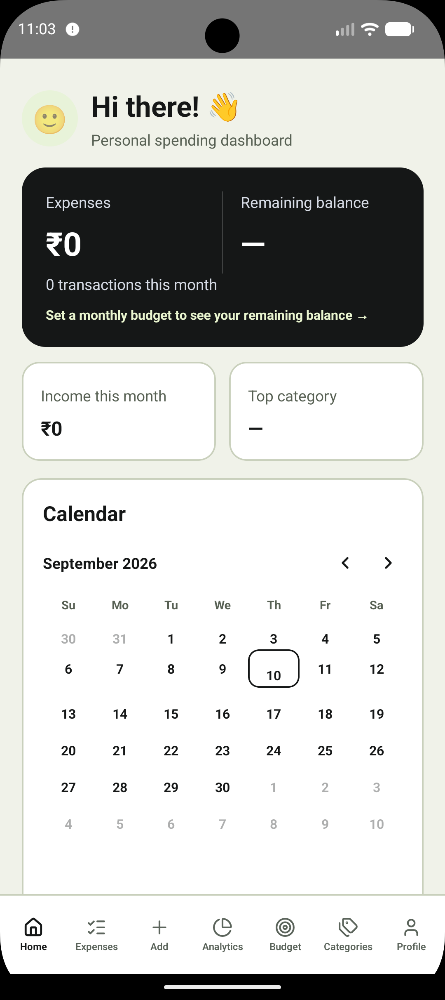
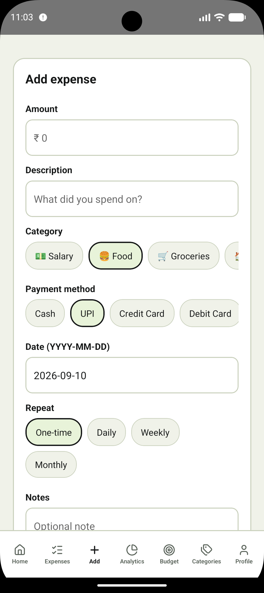
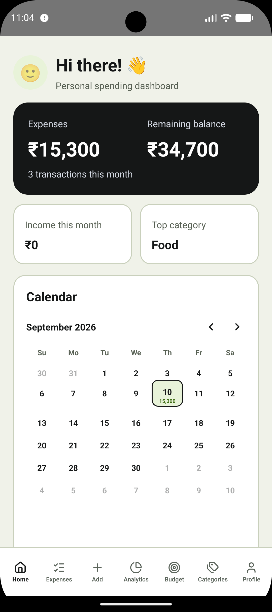
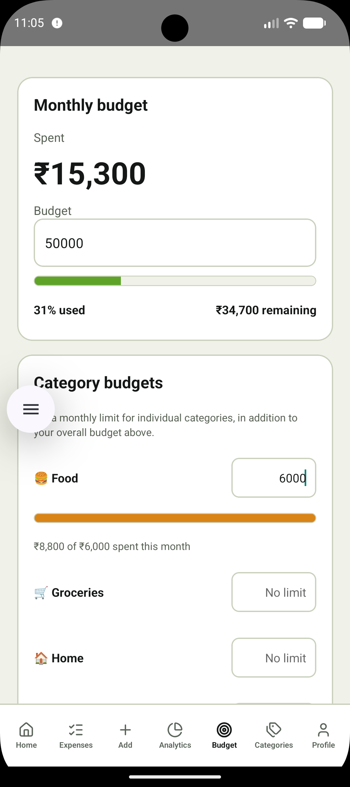

# 💰 Daily Expense Tracker

A simple, private, and fast way to track **where your money actually goes** — every day, without the spreadsheet effort.

## 🚀 Try it

- **Web app:** [my-daily-expense-tracker.vercel.app](https://my-daily-expense-tracker.vercel.app/)
- **Mobile app:** Coming soon (Check Screenshots below)

## 📸 Screenshots

### Mobile preview

These mobile-sized previews show the responsive web app. The native Android app is also available for testing, with the current emulator screen shown below.

| Dashboard | Expenses |
| --- | --- |
|  |  |
|  |  |

## 📖 Why this exists

For a middle-class household, every rupee has a job — rent, groceries, fuel, school fees, EMIs, the occasional treat. But most people don't track spending daily because it feels tedious: opening a spreadsheet, remembering categories, calculating totals by hand. By the time the credit card bill arrives, it's too late to course-correct.

**Daily Expense Tracker** is built to remove that friction. Logging an expense takes seconds. The dashboard immediately shows what you've spent, what's left in your budget, and where the money is going — so you can make small daily adjustments instead of being surprised at month-end. It works the same way on the web and on your phone, keeps every entry completely private on your own device, and never asks you to sign up, log in, or share your financial data with anyone.

## ✨ Features

### Fast, everyday expense logging
- Add an expense in a few taps — amount, category, payment method, date, and an optional note
- Edit or delete any past entry
- Tap any date on the calendar to add an expense straight for that day, no extra navigation
- While adding an expense, instantly see any other expenses already logged for that same date
- Search expenses by description or note
- Filter expense history by category or by a custom date range

### At-a-glance dashboard
- Clear headline view of **Expenses** and **Remaining balance** for the month, front and center
- Income for the month and your top spending category
- Interactive calendar with daily spending highlighted
- Recent expenses list for a quick check-in
- Friendly guidance instead of clutter — a fresh install starts empty and simply shows you where to add your first expense, with no fake or placeholder data anywhere

### Budgeting that keeps you honest
- Set a monthly budget and track spending against it in real time
- Per-category budgets too, not just one overall number
- Recurring expenses — rent, EMIs, subscriptions — set once (daily/weekly/monthly) and they log themselves automatically, catching up on anything due since you last opened the app
- Visual progress bar with percentage of budget used
- Clear "remaining balance" figure at all times
- Automatic warning once spending crosses 80% of budget

### Spending insights
- Category-wise spending breakdown (chart on web)
- Daily spending trend for the month
- Month-over-month income vs. expense comparison
- Highest spending category surfaced automatically

### Categories that fit your life
- Sensible built-in categories: Food, Groceries, Home, Transport, Fuel, Medical, Bills, Education, Shopping, Entertainment, Travel, Investment, Gifts, and more
- Add your own custom categories, with a choice of icon, for anything not covered
- A clear warning before deleting a category that's still used by past expenses, so you're never surprised
- Track income (e.g. Salary) alongside expenses to see the full picture

### A profile that feels like yours
- Personalize your dashboard greeting with a nickname
- Choose a profile avatar, or upload your own photo on web
- Basic profile details (name, email) stored locally with your data

### Export and backup, on your terms
- Export your full expense history to Excel or CSV for record-keeping, tax filing, or sharing with family
- One-tap full data backup (expenses, categories, budgets, recurring expenses, and profile) to a portable file
- Backups are **password-encrypted** before they ever touch disk — safe to save to a shared Drive folder, email to yourself, or keep on a USB drive
- Restore your data from a backup at any time — essential when reinstalling the app or moving to a new phone, since this app deliberately keeps no server-side copy of your data
- Full transparency in-app about what backup covers and why it matters

### Security
- Optional app-open lock — PIN on both platforms, plus Face ID / fingerprint on mobile
- Automatically re-locks when the app is backgrounded (mobile) or the tab is hidden (web), not just on cold start
- Deleting an expense shows an "Undo" option for a few seconds instead of only an irreversible confirmation

### Private by design
- No account, no sign-up, no login, no ads
- All data lives only on your own device — nothing is sent to a server
- Data is **encrypted at rest**: mobile uses the device's secure Keychain/Keystore to protect a locally generated key, and web uses a non-extractable key stored in the browser to encrypt everything before it touches disk
- Because there's no cloud account behind it, you are always in full control of your own financial data — and also in charge of backing it up

### Works the way you do
- One shared codebase for consistent behavior between the web app and the native mobile app (Android and iOS)
- Clean bottom/side navigation with dedicated Home, Expenses, Add, Analytics, Budget, Categories, and Profile screens
- Empty states and hints throughout that guide you toward entering real data, instead of showing confusing sample numbers
- Light and dark appearance (web)

## 🔒 Storage & privacy

This app is intentionally backend-free — there is no server, no database, and no account behind it. Everything you enter stays encrypted on your own device:

- **Web** → data is encrypted with a non-extractable key stored in the browser, ciphertext kept in `localStorage`
- **Mobile** → data is encrypted with a key stored in the device's Keychain (iOS) or Keystore (Android), ciphertext kept in `AsyncStorage`

## 🎯 The goal

Not just to record numbers, but to answer the question that matters every single day:

> **"Where is my money going, and what can I do about it — today, not just at month-end?"**
